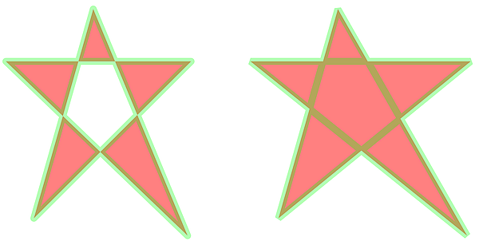
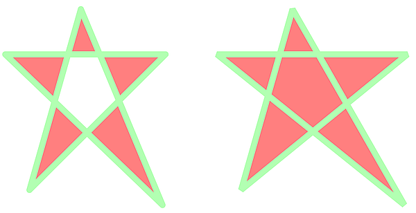

# Atomic "Fill & Stroke" combined painting operations 

A common PDF rendering issue involves the combined "fill and stroke" painting operators. **b**, **B**, **b\*** and **B\***. The capabilities of modern illustration authoring packages and expectations of easy conversion to and from other formats makes it critical for PDF renderers get the basics of fill and stroke operations correct - especially in the presence of transparency.

In other graphic languages, combined fill/stroke operations are often just a short-hand convenience for performing a sequence of independent paint operations, commonly "fill _then_ stroke" (e.g. SVG) or occassionally "stroke _then_ fill". In these rendering models, there is a clear Z-order difference between the fill and stroke objects. However, in PDF, the combined "fill _and_ stroke" painting operations must be treated as an **atomic painting operation** when transparency is applied, such that the overlapping stroke and fill area is not visibly distinct and that the full width of the stroke always has a consistent experience. This is simply how PDF is defined.

Both ISO 32000-1 and ISO 32000-2 state "_For transparency compositing purposes a path shall be treated as a single graphics object as described in 11.6.2, "Specifying source and backdrop colours_". Of particular importance is that the text specifies _path_, not to be confused with the _subpaths_ that make up paths.

Subclause 11.7.4.4 "Special path-painting considerations" in both ISO 32000-1 and ISO 32000-2 state also explicitly state: "_For transparency compositing purposes, the combined fill and stroke shall be treated as a single graphics object, as if they were enclosed in a transparency group._" and goes on to describe how the implicit transparency group model works.  

## Incorrect appearance
Note that the stroke has 2 distinct colors - this is because the fill is below (or above) the stroke and the transparency in the stroke is compositing with the fill for the inner half-width overlap. This is wrong!

## Correct appearance
Note that the stroke has a single color along the entire path length and for the full width of the stroke, including at the self-intersection points. This is correct!

The introduction of PDF 1.4 and the transparent imaging model in 2001 added complexity to PDF's rendering model, as the fill (non-stroking) color and stroking color could each have an independent level of transparency applied. Prior to PDF 1.4, fill and stroke colours were entirely opaque. Now, 22 years on, every PDF renderer should get basic filling and stroking with transparency correct.

Another common failure occurs where a path has self-intersection - where a subpath intersects with another subpath that is part of the same path. Because of the atomic nature of the fill and stroke painting operation the "overlap" between the two intersecting subpaths is again not visibly distinct from any other part of the stroke.

Further filling and stroking complexity arises when overprinting is enabled. The test PDFs provided here do **not** have overprinting enabled, as not all renderers support overprinting. Nonetheless, every PDF renderer needs to support the basics of fill and stroke operations in the presence of simple constant alpha transparency!

## TEST FILES

### [FillStrokeOrdering.pdf](FillStrokeOrdering.pdf)
This hand-crafted and commented PDF file (viewable in a text editor) contains 6 fill and stroked squares drawn as 2 columns x 3 rows using different sequences of painting operations and opaque and transparent colors. The stroke is also dashed so the edge of the fill area (i.e. the center line of the stroke) is visible.

- **Top row**: Fill then stroke as separate independent painting operations. 
    - Left uses opaque colors. 
	- Right has different transparency for both fill and stroke colors.
- **Middle row**: Stroke then fill as separate independent painting operations. 
    - Left uses opaque colors. 
	- Right has different transparency for both fill and stroke colors.
- **Bottom row**: Combined "fill and stroke" as _single_ painting operation. 
    - Left uses opaque colors. 
	- Right has different transparency for both fill and stroke colors.

### [SelfIntersecting-Opaque.pdf](SelfIntersecting-Opaque.pdf)
A hand-crafted and commented PDF file (viewable in a text editor) that uses combined "fill and stroke" painting operations with a self intersecting shape. Both fill and stroke colors are fully opaque (i.e. there is no transparency or overprinting in this PDF). The shape on the left uses the Odd/Even Winding Rule while the shape on the right uses the Non-Zero Winding Rules.

### [SelfIntersecting-Transparency.pdf](SelfIntersecting-Transparency.pdf)
A hand-crafted and commented PDF file (viewable in a text editor) that uses combined "fill and stroke" painting operations with a self intersecting shape - the same as [SelfIntersecting-Opaque.pdf](SelfIntersecting-Opaque.pdf).  However the stroke has a Constant Alpha of 30% (`/CA 0.3`) and the fill has a a Constant Alpha of 50% (`/ca 0.5`) which is set via a Graphics State Parameter dictionary using the `gs` operator.  The shape on the left uses the Odd/Even Winding Rule while the shape on the right uses the Non-Zero Winding Rules.

### [svg-test.html](svg-test.html)
This is a very simple HTML file with the same simple SVG self-intersecting shape showing how SVG combined fill/stroke operations are really independent "fill _then_ stroke" operations. It also demonstrates how, for the specific test case shown, the use of [premultiplied alpha](https://en.wikipedia.org/wiki/Alpha_compositing) might be used to accurately simulate PDF's atomic "fill and stroke" rendering model even though the two graphic languages are fundamentally different.
