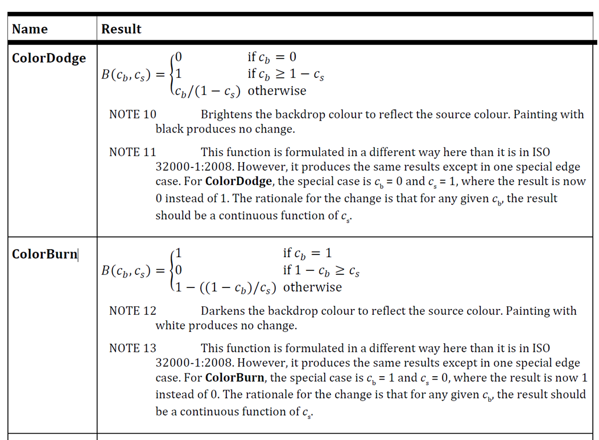
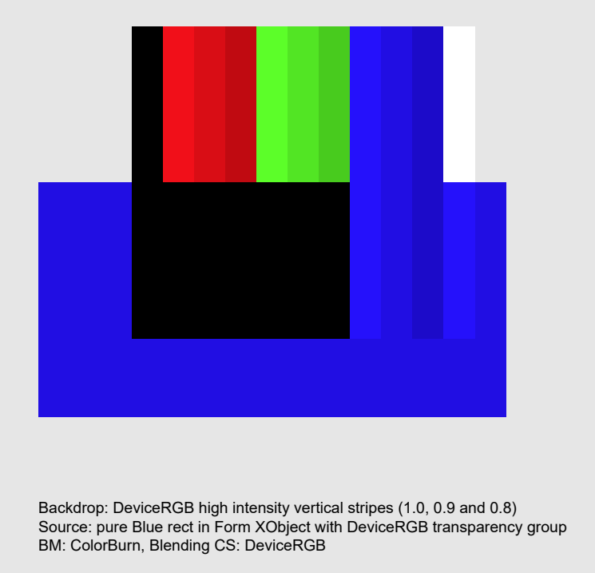
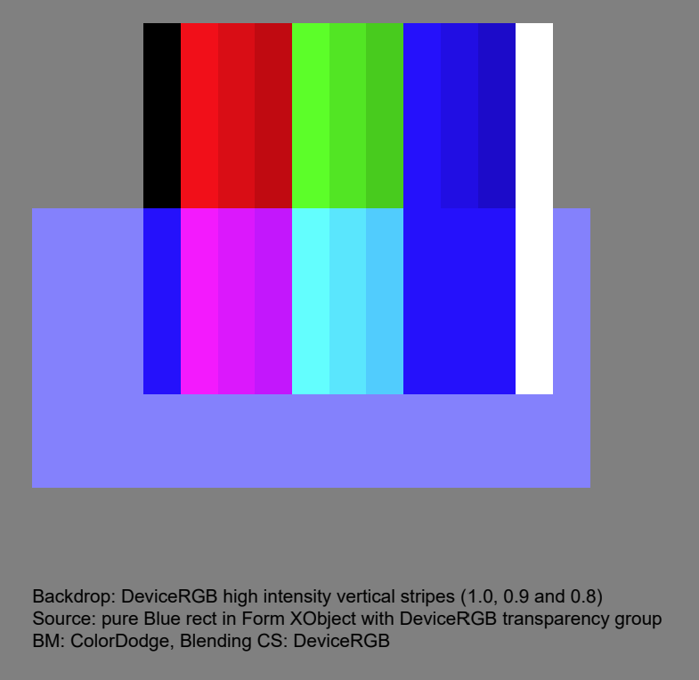
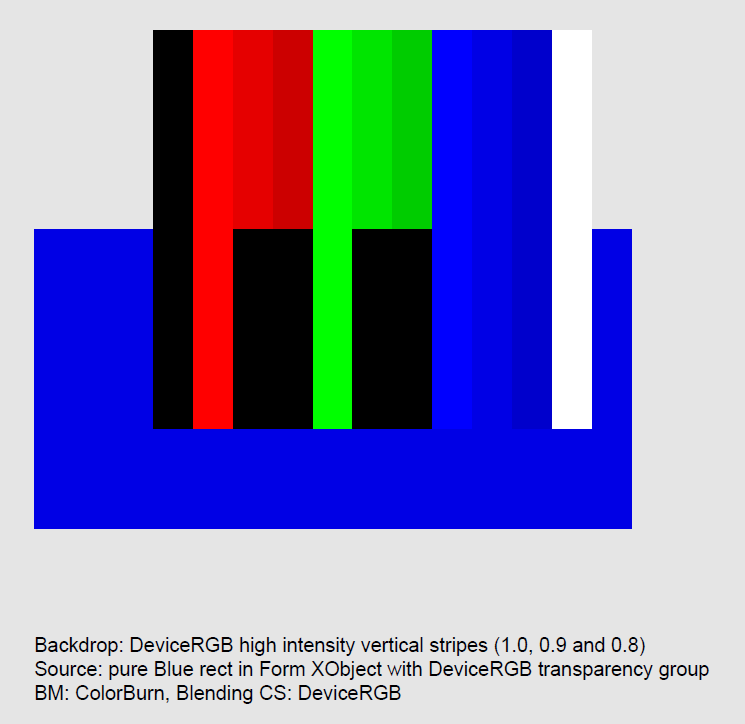
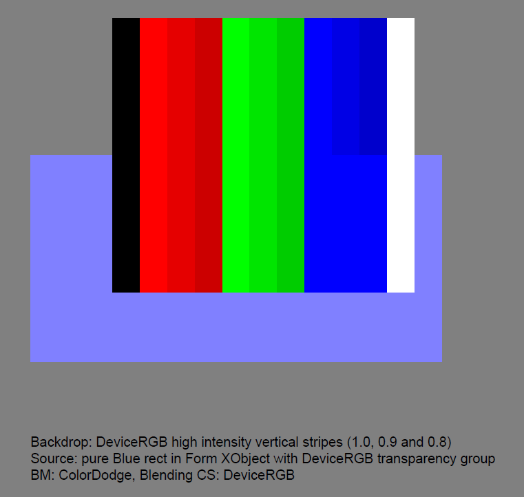

# ColorBurn and ColorDodge Blend Modes

"[_Adobe® Supplement to ISO 32000-1 BaseVersion: 1.7 ExtensionLevel: 5_](https://pdfa.org/resource/pdf-specification-index/)" published by Adobe in June 2009 corrected the **ColorBurn** and **ColorDodge** blend mode formulae and noted the following:

> Note: These functions are formulated in a different way here than they are in ISO 32000-1. However, they produce the same results except in one special edge case. For **ColorDodge**, the special case is _cb_ = 0 and _cs_ = 1, where the result is now 0 instead of 1. For **ColorBurn**, the special case is _cb_ = 1 and _cs_ = 0, where the result is now 1 instead of 0. The rationale for the change is that for any given _cb_, the result should be a continuous function of _cs_.

This was later formalized in the ISO 32000-2:2020 standard:

## Wrong appearances

## Correct appearances

## TEST FILES

### [ColorBurn.pdf](ColorBurn.pdf)
This hand-crafted and commented PDF file (viewable in a text editor) uses the ColorBurn blend mode within a DeviceRGB transparency group. The backdrop are the vertical DeviceRGB stripes in various high-intensity RGB colors. The source is the constant color full intensity blue rectangle.

### [ColorDodge.pdf](ColorDodge.pdf)
This hand-crafted and commented PDF file (viewable in a text editor) uses the ColorDodge blend mode within a DeviceRGB transparency group. The backdrop are the vertical DeviceRGB stripes in various high-intensity RGB colors. The source is the constant color full intensity blue rectangle.
