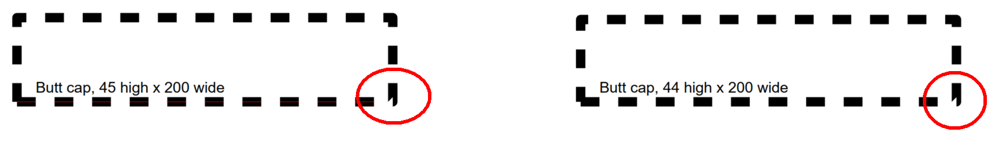
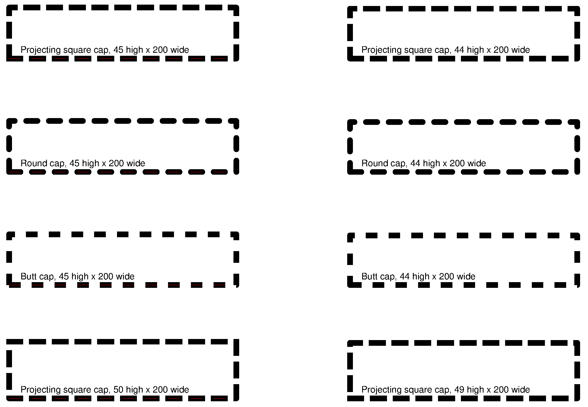

# Degenerate Dashing

The development of ISO 32000-2 was the first opportunity for a rigorous vendor-neutral review of the entire PDF specification in an open, consensus-based forum. As a result, many undocumented areas, issues and errors were corrected. Sometimes these were just small wording changes or the addition of a sentence. This is one such correction that not every implementer noticed.

In subclause 8.4.3.4 "Line join style", two paragraphs were added below Table 54. The first paragraph states:

> A zero length dash occurring at a zero length subpath segment does not have a determinable direction and thus, if the line caps are non-round is rendered in an implementation-dependent manner.

This clearly states that there is no right or wrong rendering for the situation described and implementations may vary. If PDF creation software desire fully deterministic rendering then such subpaths must be avoided!

Let’s break the first statement down: a "zero length dash" may sound unusual but it is a common idiom that is used to create a dotted line with round dots by just using round end caps with zero length "on" dashes and non-zero "off" dashes to space out the "dots". A "zero length subpath segment" is created when a subpath is specified that results in a subpath at the same coordinates as the previous subpath. 

Assume we are using projecting square caps with the following simple example:

```
x1 y1 m   % start a path "moveto"
x2 y2 l   % 1st subpath "lineto" from (x1,y1) to (x2,y2)
x2 y2 l   % 2nd subpath "lineto" from (x2,y2) to (x2,y2) <-- creates a zero length subpath
x3 y3 l   % 3rd subpath "lineto" from (x2,y2) to (x3,y3)
...
```

This 2nd subpath does not have a "determinable direction" (_Is it an extension of the 1st subpath so in that direction? Is it an extension of the 3rd subpath’s direction? Is it some other direction altogether - maybe half of the direction between subpaths 1 and 2?_). Accordingly, it is not possible to determine in which direction the projecting square caps should project. Rather than force a document to fail to render over such a technical error (most likely caused by an application’s PDF creation logic which fails to generate sensible paths), this niche degenerate case is now defined to be "implementation-dependent" – so if you want entirely deterministic rendering please do **not** generate such subpaths!

The second paragraph below Table 54 in ISO 32000-2:2020 states:

> In a closed subpath that is dashed, if the first segment starts with an on-dash and the last segment ends within an on-dash, then they shall be joined.

This is a clearly defined degenerate condition which no previous PDF specification described.

This means that the current line join style must also be painted when such a subpath occurs whether implicitly (such as via the `re` operator or one of the path paint operators (`b`, `b*` `f`, `s`) that is specified to close the path) or explicitly via the `h` operator.

Let's break this second statement down further.

Consider a simple rectangle drawn with a single `re` operator (implicitly closed!) and which is dashed with `[ 10 10 ]` (meaning 10 units on, 10 units off, 10 units on, etc). As a general expectation you would think that the appearance of all 4 corners would be the same, but without this new statement in ISO 32000-2:2020 a similar appearance may not be the case as older specifications left unstated whether the join should apply or not!

In ISO 32000-2:2020 subclause 8.4.3.6 "Line dash pattern" the follow wording was also added (a so-called "End before Bend" rule):

> If the end of a dashed segment coincides exactly with a join point, then the end cap is painted before the corner.

Prior PDF specificatons did not provide any wording addressing the order of operation which left implementations open to variation. With PDF 2.0 this situation is now clearly and unambiguously defined. This can also serve to inform implementations of earlier PDF versions as to how the ISO committee has agreed to resolve this ambiguity.    

See the more targeted tests for this new statement.

The addition of a new NOTE:

> NOTE As noted in 8.5.3.2, "Stroking" and in "Table 58 — Path construction operators", closed paths have no end caps, but the individual dash segments of a path stroked using a non-empty line dash pattern are individually open paths and therefore receive end cap processing as specified in the graphics state. If any dash segment includes a corner then that corner is painted using the current join style in the graphics state. If a corner is not contained within any dashed segment the corner is not painted.

Summarized, this means if an "on" dash segment occurs on a corner, then the line join is appled to the dash segment. And because of "End before Bend" rule, if the end of an "on" dash segment ends exactly on a corner, then the end-cap is painted, rather than the line join (because the dash ended before the bend).

## Incorrect appearance



## Correct appearance according to ISO 32000-2:2020

**Note:**  due to floating point errors some variation may occur between renderers under some circumstances. The sample PDFs here all use small magnitude integers to avoid such issues as much as possible. However, these PDFs may _not_ work for all implementations, but developers can easily alter the content in a suitable way to understand how their implementation respond.



## TEST FILES

### [DegenerateDashing.pdf](DegenerateDashing.pdf)
This hand-crafted and commented PDF file (viewable in a text editor). Close inspection of the corners of all rectangles is required. All rectangles in the left column do **not** have the line join applied in the lower left corner. The rectangle with round caps _appears_ as though it might, but this is a _line cap_, not the _line join_, which are the same in the 2nd row. Small magnitude integers that are accurately representable by floating point numbers have been used for all coordinates however as with other dashing test cases, this PDF is sensitive to rounding, error accumulation, etc. so any issues may need to be investigated in a debugger where the results of intermediate calculations can be examined for precision and accumulated error.
