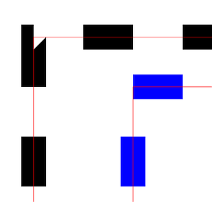
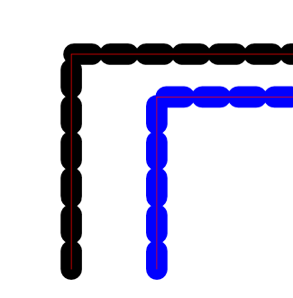
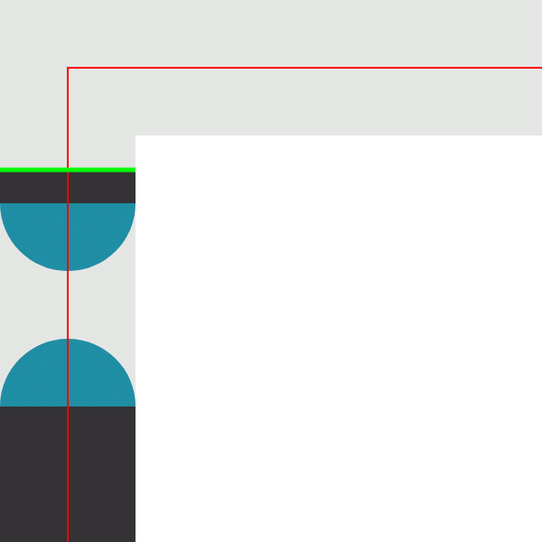
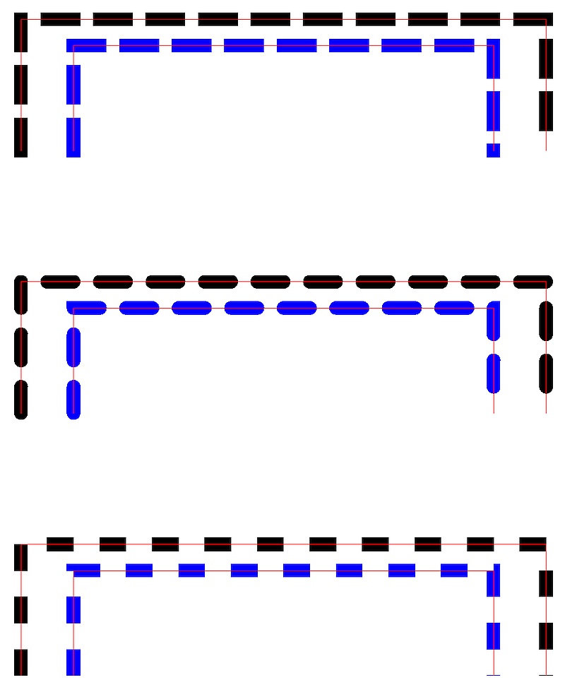

# Dashing "End before Bend"

The development of ISO 32000-2 was the first opportunity for a rigorous vendor-neutral review of the entire PDF specification in an open, consensus-based forum. As a result, many undocumented areas, issues and errors were corrected. Sometimes these were just small wording changes or the addition of a sentence. This is one such correction that not every implementer noticed.

ISO 32000-2 subclause 8.4.3.6 "Line dash pattern" had a critically important sentence added to the second last paragraph:
> _If the end of a dashed segment coincides exactly with a join point, then the end cap is painted before the corner._

This can be easily remembered as simply "End before Bend" (rather than "Bend before End") - and this applies **equally** to both the "on" and "off" segments in a dashed line. Prior to the addition of this simple sentence, implementations produce visibly different results - now they have clear direction as to what a correct implementation must do!

ISO 32000-2 subclause 8.4.3.6 "Line dash pattern" also had a new NOTE that was not present in PDF 1.7:

> NOTE As noted in 8.5.3.2, "Stroking" and in "Table 58: Path construction operators", closed paths have no end caps, but the individual dash segments of a path stroked using a non-empty line dash pattern are individually open paths and therefore receive end cap processing as specified in the graphics state. If any dash segment includes a corner then that corner is painted using the current join style in the graphics state. If a corner is not contained within any dashed segment the corner is not painted.

## Wrong appearances

Also note that changing the zoom factor of many viewers can alter how this file is rendered! This fails the device independent rendering that PDF requires!

## Correct appearance

 

Although aspects of this image may appear like "undesirable artifacts", it is in fact precisely correct as both the "on" and "off" dash segments have the "End before Bend" rule applied which thus causes an "on" dash to restart just _prior_ to bending around a corner.

## TEST FILES

### [Dashing-EndBeforeBend.pdf](Dashing-EndBeforeBend.pdf)
This hand-crafted and commented PDF file (viewable in a text editor) and has the following features:

- The black dashed line is constructed such that dashes will end at each corner to test "End before Bend".
- The blue dashed line is constructed to have corners ("bends") just before and just after the corners (bends).
- In each case, the fine red line is simply the same path that is dashed (i.e. the center line).
- All lines are drawn from lower left, up, across, and then down to finish in the lower right.
- The top pair of dashed lines use projecting square caps (Line cap style = `2`).
- The middle pair of dashed lines use round caps (Line cap style = `1`).
- The lower pair of dashed lines have no caps (i.e. butt caps, Line cap style = `0`).
- The choice of coordinate system and use of integer coordinates ensures that the likelihood of floating point inaccuracy is very unlikely with this test case. However this is possible and may result in a final circular dash or square dash (for projecting square caps) in some cases. This is considered acceptable.
