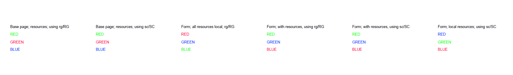

# Default Colour Spaces

Each PDF device-dependent colour space (**DeviceGray**, **DeviceRGB**, and **DeviceCMYK**) can be mapped via a default colour space (**DefaultGray**, **DefaultRGB**, and **DefaultCMYK** respectively) to some other colour space - typically to a device-independent colour space. However they can also be used to significantly transform colours so supporting default colour spaces is critical in ensuring correct and consistent colour in PDF documents. If default colour spaces are ignored then an incorrect appearance can result.

In PDF 2.0 clause 7.8.3 "Resource dictionaries", resource inheritance was clarified ([including recently via errata](https://pdf-issues.pdfa.org/32000-2-2020/clause07.html#H7.8.2)). Default colour spaces need to be specified in the **ColorSpace** subdictionary of the current resource dictionary and will need to follow the legacy resources inheritance rules if legacy files are to be supported. 

ISO 32000-2:2020, subclause 8.6.5.6 "Default colour spaces" also states:

> Colour values in the original device colour space shall be passed unchanged to the default colour space, which shall have the same number of components as the original space. The default colour space should be chosen to be compatible with the original, taking into account the components’ ranges and whether the components are additive or subtractive. If a colour value lies outside the range of the default colour space, it shall be adjusted to the nearest valid value.

Note that the test files as provided do _not_ test this rounding of colour component values since both **DeviceRGB** and **CalRGB** have the same range (0.0 - 1.0 inclusive for all 3 RGB colour components). 

See also [PDF Errata #315](https://github.com/pdf-association/pdf-issues/issues/315) with an [additional more complex test PDF](https://github.com/pdf-association/pdf-issues/files/12240882/DefaultColourSpaces.230802.pdf). 

# Test files

These synthetic text-based human-readable test file define different **DefaultRGB** resources using **CalRGB** colour spaces with matrices that swap various RGB colour components, thus creating visually significant colour differences when painting with **DeviceRGB**. They include tests for all operators that invoke **DeviceRGB** (i.e. both `rg`/`RG` and `sc`/`SC` operators). PDF processors that do _not_ support default colour spaces will render all cases identically, with the name of each of the 3 RGB colorants always being in that colour. 

The leftmost 2 columns of tests should be the same for each test case. 

The test files are very similar except for resource inheritance - try comparing (`diff`-ing) to see the differences. Also experiment with changing the objects used as each **DefaultRGB** resource. 

## [DefaultRGBColourSpaces.pdf](DefaultRGBColourSpaces.pdf)

As required by the latest PDF 2.0 specification, this test file explicitly defines a **Resources** dictionary with each content stream that contains all necessary named resources. 

### Correct output

## [DefaultRGBColourSpaces-inherit.pdf](DefaultRGBColourSpaces-inherit.pdf)
 
This test file tests _legacy resource inheritance_ and has a `%PDF-1.3` header. It has different output to the other test file.  _It is no longer the method that should be used for resources with PDF!_

### Correct output

