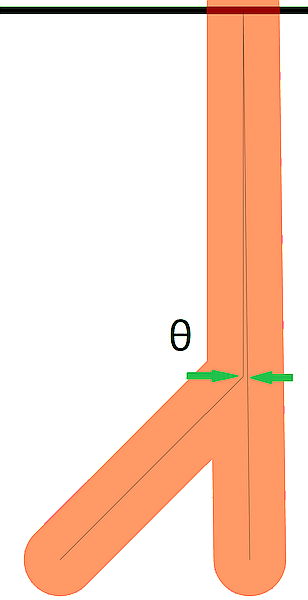
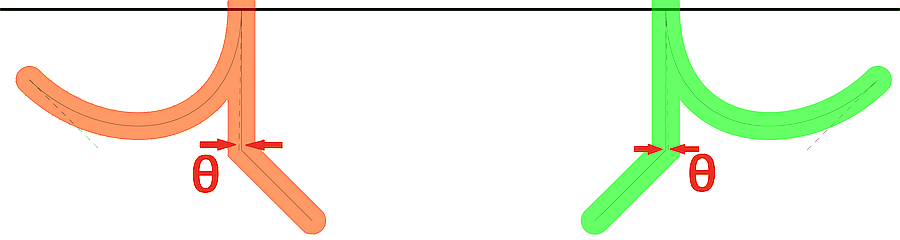

# Large Mitre Limit

_NOTE: for consistency with future ISO requirements, this article uses the International English spelling "mitre", whereas PDF specifications use the US spelling "mitre". There is no difference in meaning. This will be corrected in a future ISO publication._ 

The development of ISO 32000-2 was the first opportunity for a rigorous vendor-neutral review of the entire PDF specification in an open, consensus-based forum. As a result, many undocumented areas, issues and errors were corrected. Sometimes these were just small wording changes or the addition of a sentence. This is one such correction that not every implementer noticed.

Note that the formula specified in ISO 32000-2:2020 defines the _mitre limit ratio_, not the actual _mitre length_! The _mitre limit ratio_ is what is specified by `M` operator, not the _mitre length_. The _mitre length_ is what is rendered and is visible on a page. For thick lines (large line widths) mitre limits with very acute (sharp) angles, mistakes in mitre limits can be very visible.  Note that this is also all in _user space_!

<object data="figure15-mitre-length.svg" type="image/svg+xml"></object>

If the _mitre limit ratio_ is set to 333 and _line width_ is 10 units (as used in the test PDF provided), then the _mitre length_ for different acute (sharp) angles _&theta;_ is as follows (in user space):

| _&theta;_ (degrees) | Mitre Length (units, approx.) |
|---:|---:|
| 16 | 71.9 |
| 14 | 82.1 |
| 12 | 95.7 |
| 10 | 114.7 |
| 8 | 143.4 |
| 6 | 191.1 |
| 4 | 286.5 |
| 2 | 573.0 |
| 1 | 1145.9 |
| 0.5 | 2291.8 |
| 0.343 | 3340.9 |

A spreadsheet is provided to calculate mitre lengths at various angles of _&theta;_ - see [PDF-MitreLimit-Calculator.xlsx](PDF-MitreLimit-Calculator.xlsx) when in user space.

A common rendering problem is confusion between the _mitre limit ratio_ and _mitre length_, where the operand to `M` is used directly as the mitre length.  

A new informative note was added to clause 8.4.3.5 "mitre limit":

> NOTE: Very large mitre lengths are allowed.

It had been noticed that some implementations imposed additional unspecified maximum limits on the mitre limit when an explicitly specified mitre join would be silently ignored and converted to the much less visible bevel join, against the PDF files explicit request. This causes visible differences in rendering (visual appearance) between implementations, including between screen and print.

To understand why a single maximum limit cannot be explicitly stated in PDF, it is necessary to understand the subtle points and complexities of rendering, quantisation, and the differences in rendering algorithms often used between screen (lower resolution rendering, possibly with anti-aliasing) and print (very high-resolution rendering, possibly halftoned). This is too technical and too long for this short article, except to state that mitre joins on wide lines meeting at very acute (sharp) angles eventually result in a very narrow line. 

Implementers of PDF renderers should re-examine their code supporting mitre lengths to ensure that they support large mitre limits appropriate to their rendering model, without artifacts caused by scrolling, panning or zooming (_please test this!_). It is also extemely likely that variations of this test PDF will be needed, but that is left as an exercise for software engineers!   

## TEST FILES

### [animated-mitres.html](animated-mitres.html)
This is a semi-interactive animated HTML/SVG visualization of how PDF mitres work. Users can change the line width and mitre limit to see when the mitre limit begins to apply. Note that the bevel join that PDF specifies ("_When the limit is exceeded, the join is converted from a mitre to a bevel._") is **not** shown in this animation as that is not how SVG is specified. The transparent effects shown in this animation are solely for aiding understanding of the construction of the mitre.  

### [LargeMitreLimit.pdf](LargeMitreLimit.pdf) and [LargeMitreLimit-Beziers.pdf](LargeMitreLimit-Beziers.pdf)
These hand-crafted and commented single page PDF files (viewable in a text editor) set very large mitre limits between path segments. All line widths are 10 units and narrow (zero width) centreline construction is also shown. Page zooming, panning and scrolling should also be checked in interactive PDF viewers to check the appearance of mitres. The following figures show the construction of the test cases and how the acute (sharp) angle is created:

The page `MediaBox` is such that the `Y` axis origin (`Y`=0) is at the point of the path join. No additional coordinate systems are used, as everything is specified in user space.  Each test is a pair of actute angled paths with large mitre limits - the only difference being whether the path is drawn as a vertically straight line followed by the Bezier, or vice-versa. The red lines have a mitre limit of 333 (integer) and the green lines have a slightly larger mitre limit of 333.3276 (real number). Narrow black horizontal lines every 100 units are used to form a simple mitre length measurement grid on the page to assist with checking the lengths of rendered mitres, with an additional blue grid line at `Y`=333 to highlight any confusion between the _mitre limit ratio_ and _mitre length_.

### [PDF-MitreLimit-Calculator.xlsx](PDF-MitreLimit-Calculator.xlsx)
This spreadsheet can assist with manually calculating when a mitre line join will change from a mitre to a bevel (when the _mitre limit ratio_ is exceeded) and how altering various construction points will impact the mitre calculations. Note that these calculations need to be in _user space_!
