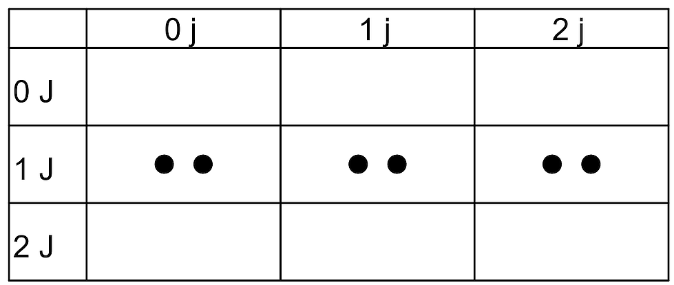
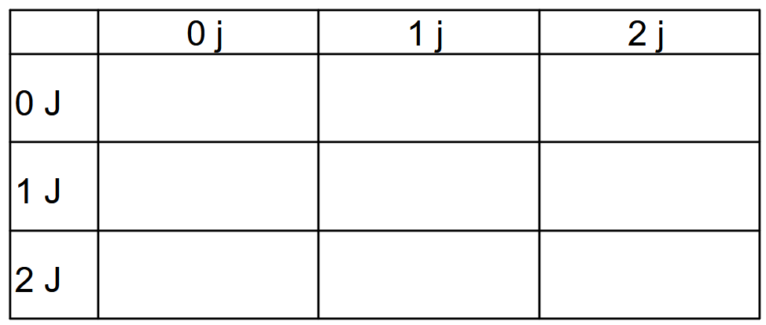

# Degenerate Line Caps

This difference has been created as a result of [PDF Errata #507](https://github.com/pdf-association/pdf-issues/issues/507). It uses the same targeted PDF test file (renamed).

The last paragraph in clause 8.5.3.2 Stroking states:

> If a subpath is degenerate (consists of a single-point closed path or of two or more points at the same coordinates), the **S** operator shall paint it only if round line caps have been specified, producing a filled circle centred at the single point. If butt or projecting square line caps have been specified, **S** shall produce no output, because the orientation of the caps would be indeterminate. This rule shall apply only to zero-length subpaths of the path being stroked, and not to zero-length dashes in a dash pattern of a non-degenerate subpath. In the latter case, the line caps shall always be painted, since their orientation is determined by the direction of the underlying path except in the case of a degenerate subpath. A single-point open subpath (specified by a trailing **m** operator) shall produce no output.

In each case the stroked (**S** operator) path is perfectly horizontal with two degenerate (i.e. zero length, created by just an **m** operator) explicitly closed (via **h** operator) subpaths - the first at `(0,0)` and the second at `(10,0)`.

## Correct Appearance

Correct output should be 2 dots (circles) representing the degenerate subpaths only when round line caps (`1 J`) are in effect.

## Incorrect Appearance

## TEST FILES

### [LineCap-Degenerate.pdf](LineCap-Degenerate.pdf)
