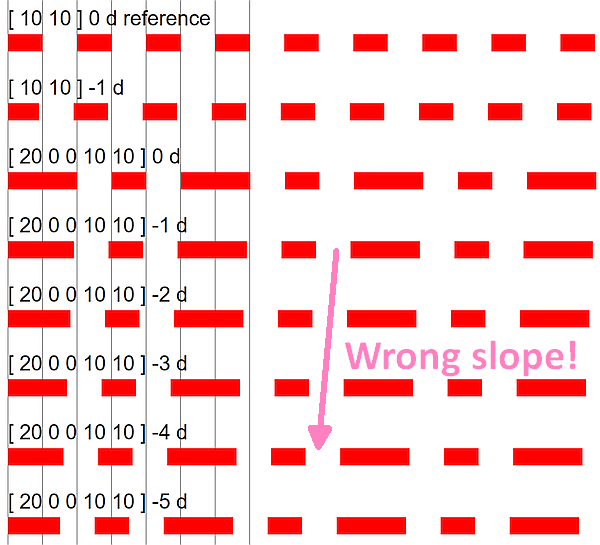
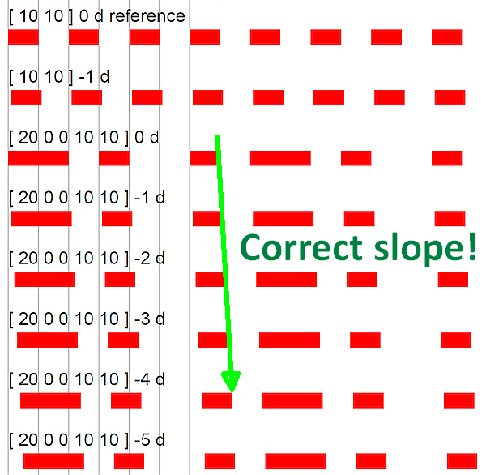

# Negative Dash Phase

The development of ISO 32000-2 was the first opportunity for a rigorous vendor-neutral review of the entire PDF specification in an open, consensus-based forum. As a result, many undocumented areas, issues and errors were corrected. Sometimes these were just small wording changes or the addition of a sentence. This is one such correction that not every implementer noticed.

ISO 32000-1:2008 (PDF 1.7) subclause 8.4.3.6 "Line dash pattern" stated:

> The dash phase shall specify the distance into the dash pattern at which to start the dash. As can be seen from the table, an empty dash array and zero phase can be used to restore the dash pattern to a solid line.

This wording failed to state how a negative dash phase should be rendered in PDF, as is visible through the different renderings of the test PDF provided here.

ISO 32000-2:2020 subclause 8.4.3.6, "Line dash pattern" was updated to state:

> The dash phase shall be a number that specifies the distance into the dash pattern at which to start the dash. If the dash phase is negative, it shall be incremented by twice the sum of all lengths in the dash array until it is positive. The elements of both the dash array and the dash phase shall be expressed in user space units.

The updated specification clarifies _precisely_ how PDF renders ensure a reliable appearance when processing negative dash phases, regardless of PDF version. Table 55 "Examples of dash patterns" was also updated to include a new example with a negative dash phase.

Furthermore, all ISO 32000 editions have stated:

> If the dash array is empty, the dash phase shall be zero and the path shall be stroked with a solid, unbroken line.

Although this wording has not changed in PDF 2.0, the requirement on the dash phase to be zero is expressed as a _file format requirement_, so a separate (albeit technically invalid!) test case is provided with an empty dash array and negative dash phase to test processing robustness and behavior.

## Incorrect appearance

There are multiple possible mistakes seen when viewing this PDF file. The more subtle errors are where the "shift" in dashing from the negative dash phase occurs in the wrong "direction" on the test pattern:

Another common error is ignoring the negative phase value and rendering with a dash phase of zero. This results in no visible difference between the various dashed lines (i.e. the "slope" is vertical and all renderings are aligned with the black grid lines).

## Correct appearance

## TEST FILES

### [Negative-DashPhase.pdf](Negative-DashPhase.pdf)
This hand-crafted and commented PDF file (viewable in a text editor) uses zero-width narrow black vertical lines at a spacing of 10 units to form an alignment grid pattern. Then various dash patterns with various dash phases are drawn across the page on top of this grid for assessment. The default non-projecting butt caps are used for the dash segments so that alignment is easier to identify against the grid lines (`0 J` is not used - initial value is relied upon). All test cases use the `d` operator for ease of authoring, as it is assumed that the equivalent `D` entry in Graphics State Parameter dictionaries will have identical functionality.
