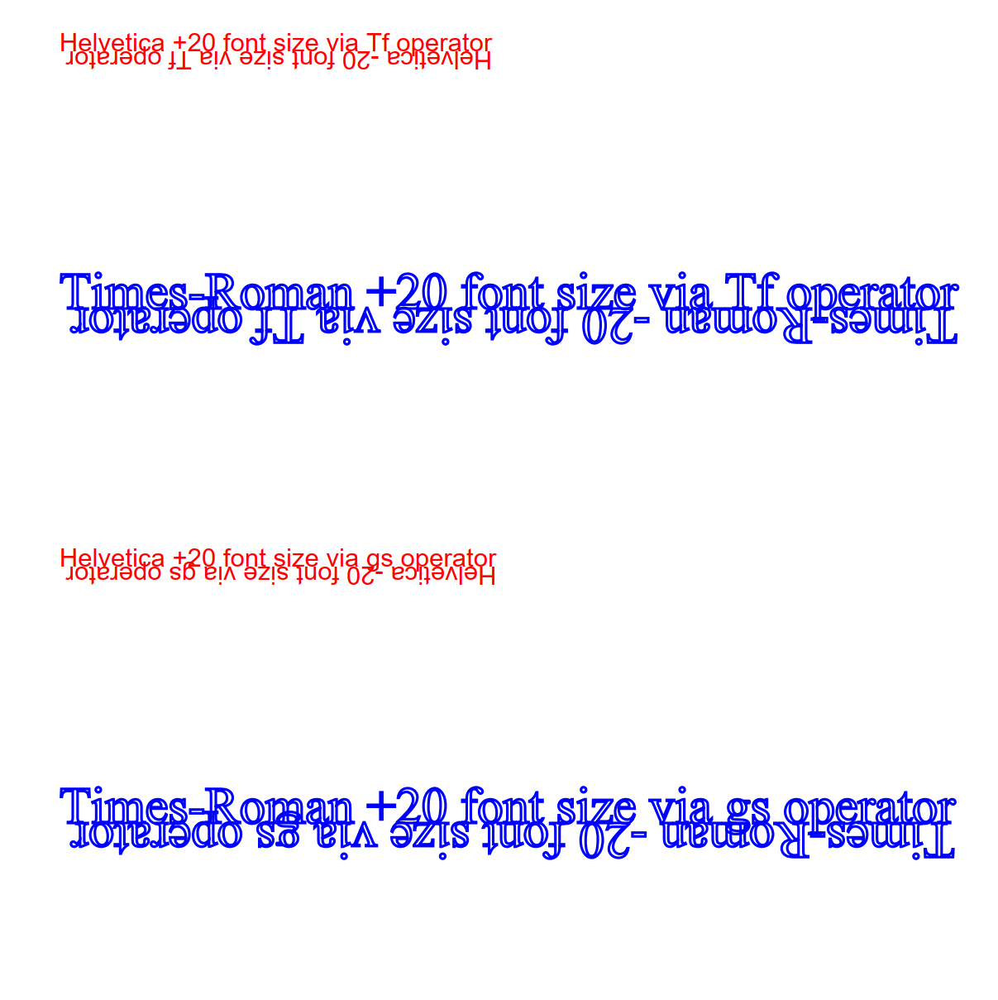

# Negative Font Size

PDF 2.0 (in ISO 32000-2:2017) added a new clarifying informative NOTE two paragraphs above "Table 103 - Text state operators":

> NOTE Negative text font size is permitted.

In addition, ISO 32000-2:2017 also clarified that "_Zero sized text shall not mark or clip any pixels (depending on text render mode)_" in the description of the **Tf** operator in "Table 103 - Text state operators".

The PDF specification has always defined text scaling and positoning mathematically via matrices, using text state parameters with &#x1D47B; and various subscript notation - for example,  &#x1D47B;<i>fs</i> represents the font size. The use of mathematical expressions allows negative font sizes which, in effect, will paint text upside and in the reverse direction (i.e. rotated 180 degrees) from the current text insertion point.

$$ T_m = \left[ \begin{array}{1}
T_{fs} \times T_h & 0 & 0 \\
0 & T_{fs} & 0 \\
0 & T_{rise} & 1 \end{array} \right] \times T_m \times {CTM} $$

Text size can be set in two ways:

- most commonly using the **Tf** operator with a named resource operand for a font named in the current resource dictionary's `/Font` sub-dictionary, and a number operand representing the text size in text space. See "Table 103 - Text state operators"; or

- less commonly via the `/Font` entry of a Graphics State Parameter dictionary invoked by the **gs** operator. This entry takes a 2 element array of the form `[`&nbsp;_\<indirect-reference-to-font>_&nbsp;_\<font-size>_&nbsp;`]`. See "Table 57 — Entries in a graphics state parameter dictionary". Note that the **gs** operator can be invoked _within_ PDF text objects (demarcated by **BT**/**ET** operators) as shown in "Figure 9 — Graphics objects".

## Correct appearance

Negatively-sized text is "upside down" while zero-sized text is not visible.

## TEST FILE

The included test file [NegativeFontSize.pdf](NegativeFontSize.pdf) tests both methods of setting the font size to positive, zero, and negative values. Filled and stroked text is also used (text render mode `Tr` operator).

