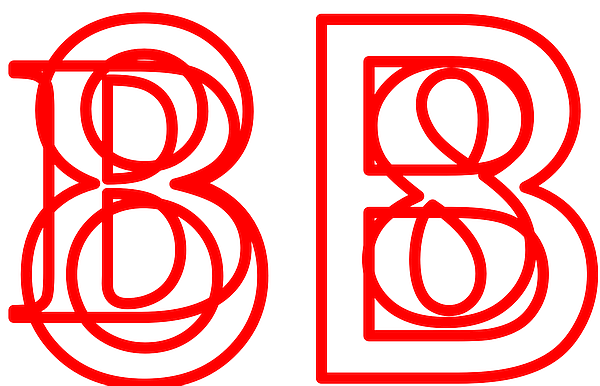
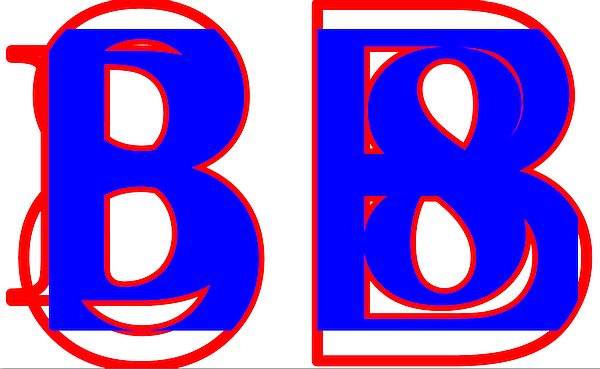

# Overlapping Glyph Clipping

ISO 32000-2:2020 subclause 9.3.6 "Text rendering mode" states:

> The behaviour of the clipping modes requires further explanation. Glyph outlines shall begin accumulating if a `BT` operator is executed while the text rendering mode is set to a clipping mode or if it is set to a clipping mode within a text object. Glyphs shall accumulate until the text object is ended by an `ET` operator; the text rendering mode shall not be changed back to a nonclipping mode before that point.

> ...

> At the end of the text object identified by the `ET` operator the accumulated glyph outlines, if any, shall be combined into a single path, treating the individual outlines as subpaths of that path and applying the non-zero winding number rule (see 8.5.3.3.2, "Non-zero winding number rule"). The current clipping path in the graphics state shall be set to the intersection of this path with the previous clipping path. As is the case for path objects, this clipping shall occur after all filling and stroking operations for the text object have occurred. It remains in effect until a previous clipping path is restored by an invocation of the Q operator.

> NOTE 2 Due to the use of non-zero winding number rule, the direction of the paths comprising each glyph can cause different output for overlapping glyphs.

As the test PDF file does **not** embed the fonts (for simplicity) there may be variations in appearance between PDF renderers, as each will need to use its own substitute fonts. This is definitely **not** "best practice" for modern PDFs but is utilized here for simplicity and does not impact the test case (just that the images shown below may have different glyph outlines). Both fonts used are from the legacy Standard 14 Type 1 fonts so differences should be minimal, but will be magnified by the very large font sizes used. Developers may also need to review the individual glyph outlines to determine if variations in rendering are caused by errors, or by differences in glyph path outline direction as per NOTE 2 in the ISO 32000-2:2020 standard.

## Incorrect appearance

## Correct appearance

## TEST FILES

### [OverlappingGlyphClipping.pdf](OverlappingGlyphClipping.pdf)
This hand-crafted and commented PDF file (viewable in a text editor) and establishes a clipping path of 2 sets of glyphs (from different typefaces). 
