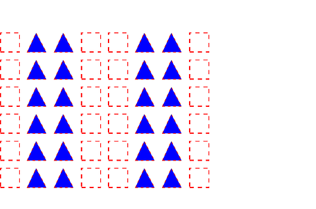
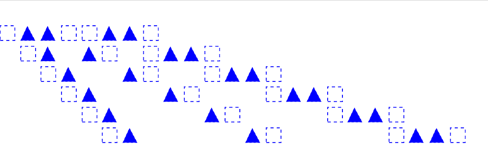
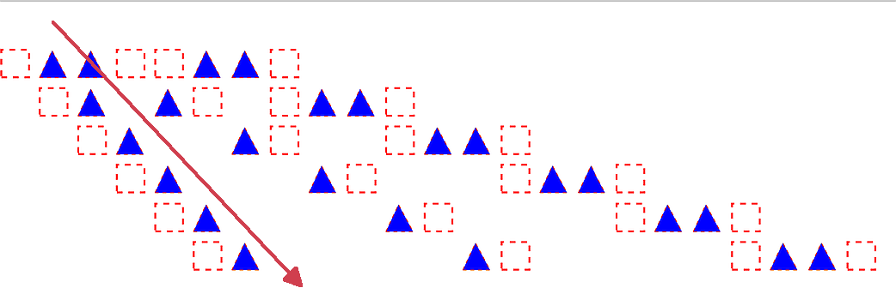

# Type 3 Word Spacing and Fill/Stroke Colour

Type 3 glyph descriptions are PDF content streams that define the appearance of each glyph in a Type 3 font. The first operator in the content stream declares whether the glyph description defines its own colour and shape (`d0` operator, see Table 111) or just its shape (`d1` operator, see Table 111). 

ISO 32000-2:2020, clause 9.6.4 "Type 3 fonts" also states:
> Aside from the CTM, the graphics state shall be inherited from the graphics state at the point of invocation of the text-showing operator that caused the glyph description to be invoked. To ensure predictable results, the glyph description shall initialise any graphics state parameters on which it depends. In particular, if it invokes any operator from "Table 59 — Path-painting operators" which performs stroking, it shall explicitly set the line width, line join, line cap, and dash pattern to appropriate values.

Like other content steams, vectors in Type 3 glyph descriptions may be stroked and according to these requirements must explicitly set their line width, dash patterns, etc. However the current fill colour _**and**_ current stroke colour in the graphics state will be inherited for `d1` glyph descriptions.

Separately, ISO 32000-2:2020 clause 9.3.3 "Word spacing" states:

> Word spacing shall be applied to every occurrence of the single-byte character code 32 in a string when using a simple font (including Type 3) or a composite font that defines code 32 as a single-byte code.

As a result, the `Tw` operator affects the glyph positioning when SPACE characters occur in Type 3 fonts. 

## Incorrect appearance

The word spacing operator `Tw` is being ignored as glyphs ared aligned vertically (but stroking and non-stroking colors are correct):

The stroking color is being ignored and the non-stroking color is also used for stroking (but `Tw` word spacing is correct):

## Correct appearance

## TEST FILES

[Type3Test.pdf](Type3Test.pdf)

This hand-coded text centric PDF file contains two Type 3 glyph descriptions: a stroked/dashed square (painted using the character "a") and a stroked (dashed) and filled triangle (painted using the character "b"). Each line (row) of glyphs is painted with the string " ab ba abba" (including explicit SPACEs) to test with different word spacing values (`Tw` operator). Correct output should show diagonal lines of glyphs indicating increasing word spacing. The stroking color is red and the non-stroking color is blue.
