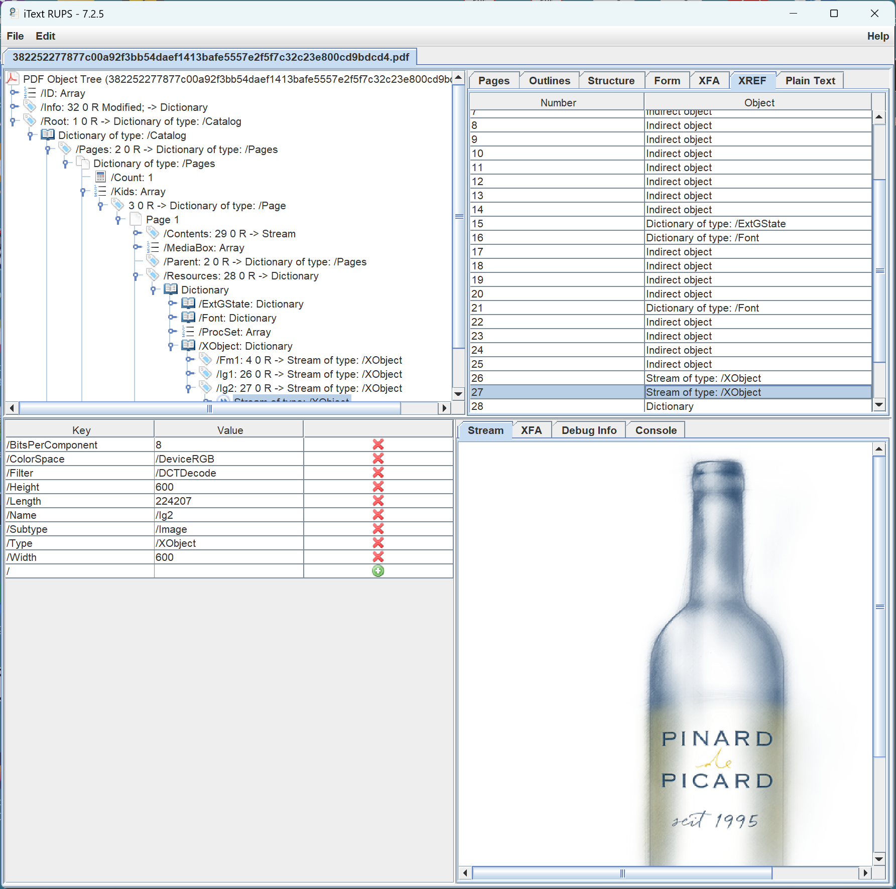

# User experience for unknown filters

It has been more than 20 years since new filters were introduced with PDF 1.5 that resulted in unprocessable files by existing software. In the intervening years, PDF applications have fully implemented all filters, and support for helpful user experiences (UX) when encountering unknown features has unfortunately slowly eroded.

As the PDF Association's [Imaging Model Technical Working Group](https://pdfa.org/community/imaging-model-twg/) considers additions to future versions of PDF to support better compression, [HDR image formats](https://pdfa.org/pdf-moves-ahead-with-hdr/), and other features, user experience must remain top-of-mind. Accordingly, the PDF Association has created this set of test files to help developers of today's PDF applications prepare to gracefully handle unexpected features.. 

One core feature of PDF is the set of supported filters (ISO 32000-2:2020, section 7.4), including both general-purpose and image compression formats. Although PDF’s history includes several occasions in which new filters were added (`/FlateDecode` in PDF 1.2, `/JBIG2Decode` in PDF 1.4, and `/JPXDecode` and `/Crypt` filters with PDF 1.5), today, some PDF implementations have lost sight of the user experience when encountering such unknown features (or features of future PDF).

The core PDF specification (ISO 32000) does not prescribe user experience behavior, but as PDF technology moves forward, the user experience must be considered. This may include warning users when opening a PDF document with an unsupported PDF version, or providing proxy content on a page (such as visually indicating missing content - where otherwise no visible indication of a problem may be indicated). Claiming a file with an unsupported PDF version is “corrupt” is not in anyone’s interests, especially users! Appropriately preparing technology for "breaking" changes to PDF is an important early step in driving acceptance and adoption of new features.

PDF streams are used for many important features, ranging from file-level compression (via cross-reference streams and object streams) to optional features such as Linearization data, fundamental features such as page content streams, and rendering-specific data such as embedded fonts and images. In some of these cases encountering an unknown stream filter can result in a complete failure to open and process the PDF (potentially cross-reference streams or object streams) while in other situations some form of fallback or alternate processing might be considered (e.g. font substitution or painting of proxy placeholders for an image). Of course, impacts depend on the specific PDF application, as not all PDF software renders pages and thus may still be able to process files with unknown filters on certain streams. 

# Test files

This set of synthetic test files includes various types of streams individually encoded with a fake "new" filter called `/XXXDecode` while also indicating a future fake PDF version (`%PDF-3.x`) in the PDF file header. In all other respects, these are valid PDF files consisting of a single PDF page containing an image and some text using an embedded subsetted font. 

These files are intended for user experience and human-computer interaction (HCI) specialists to assess the behavior of their current generation of PDF applications to ensure that appropriate user-centric messages are displayed before future PDF changes are made and available to users.

Of course, unsupported filters may occur on any stream so this set of test PDF files must not be considered comprehensive; it’s merely a starting point for assessing today's PDF technology when opening PDFs “from the future”.

## [UnknownFilter-xrefstm.pdf](UnknownFilter-xrefstm.pdf)
Only the cross-reference stream is compressed using an unknown filter (the object stream uses `/FlateDecode`). The PDF file is thus effectively unprocessable without additional recovery processing. 
Beyond unsupported filters, consider the more general challenge of new PDF features that might encode cross-reference information in improved ways.
 
## [UnknownFilter-objstm.pdf](UnknownFilter-objstm.pdf)
Only the object stream is compressed using an unknown filter (the cross-reference stream uses `/FlateDecode`). The PDF file is thus effectively unprocessable as many objects are inaccessible, even if the cross-reference stream is processable. 
Beyond unsupported filters, consider the more general challenge of new PDF features that might encode objects in improved ways.

## [UnknownFilter-Linearized.pdf](UnknownFilter-Linearized.pdf)
The optional Linearization data is compressed using an unknown filter. The PDF should be fully processable by ignoring the optional Linearization data and processing in the standard manner.

## [UnknownFilter-PageContentStream.pdf](UnknownFilter-PageContentStream.pdf)
The page content stream (of the only page in this PDF file) is compressed using an unknown filter. PDF applications may still be able to perform certain functions (e.g. count pages) as the size of the page (`/MediaBox`, `/Rotate`) is unaffected.
Beyond unsupported filters, consider the more general challenges of new PDF features that might represent content streams in improved ways, or introduce new operators.

## [UnknownFilter-Font.pdf](UnknownFilter-Font.pdf)
Only the embedded subsetted font used on the page is compressed using an unknown filter. Some applications may be able to perform font substitution or draw proxy glyphs using the available glyph width information. Other page content (the image) is fully processable. Non-rendering PDF applications may still be able to perform certain functions (e.g. count pages, extract images, etc.)

## [UnknownFilter-ImageXObject.pdf](UnknownFilter-ImageXObject.pdf)
Only the embedded Image XObject used on the page is compressed using an unknown filter. Some applications may be able to paint a proxy indication of the missing image as the size and location of the image (i.e. the bounding box) is unaffected. PDF applications that do not render pages may still be able to perform certain functions (e.g. count pages, extract fonts or text, etc.)

## [UnknownFilter-FormXObject.pdf](UnknownFilter-FormXObject.pdf)
Only the embedded Form XObject used on the page is compressed using an unknown filter. Some applications may be able to paint a proxy indication of the missing XObject as the size and location of the graphics (i.e. the bounding box) is unaffected. PDF applications that do not render pages may still be able to perform certain functions (e.g. count pages, extract images, etc.)

## [UnknownFilter-ICC.pdf](UnknownFilter-ICC.pdf)
Only the ICC profile used to paint the vector graphics in the Form XObject is compressed using an unknown filter. The ICC stream object has no `/Alternate` colour space explicitly specified and `/N` is 4. This may allow some applicationss to paint using an alternate fallback colour space (most likely CMYK-based, since `/N` is 4) or a proxy indication of the missing XObject as the size and location of the graphics (i.e. the bounding box) is unaffected. PDF applications that do not render pages may still be able to perform certain functions (e.g. count pages, extract images or text, etc.)

## [UnknownFilter-OutlinesObjStm.pdf](UnknownFilter-OutlinesObjStm.pdf)
This is a more complex hybrid-reference PDF with an incremental update that adds an outline (bookmarks) using a cross-reference stream and object stream, and where ONLY the object stream used by the incremental update (which only contains the 3 outline objects) is compressed using the unknown filter. Since bookmarks are a navigation feature, PDF applications should be able to process this PDF for most operations (e.g. count pages, extract images or text, render the page, etc). Some PDF applications may not support hybrid-reference PDFs as defined in ISO 32000-2:2020, subclause 7.5.8.4.

## Real-world example

## [382252277877c00a92f3bb54daef1413bafe5557e2f5f7c32c23e800cd9bdcd4.pdf](382252277877c00a92f3bb54daef1413bafe5557e2f5f7c32c23e800cd9bdcd4.pdf) and [4387ba480c6f935b8e97749d40b3c001ad584b7bda66ca2c040be67337669497.pdf](4387ba480c6f935b8e97749d40b3c001ad584b7bda66ca2c040be67337669497.pdf)

These are both real-world _unmodified_ PDFs that were discovered during SafeDocs and contain a related error. Some viewers may correctly display an error dialog for these PDFs, others may render a proxy placeholder for the unrenderable (invalid) image (an equivalent solution), while a few **incorrect** PDF implementations may actually display an image. This is what is known as a "parser differential" where differences between implementations, especially between those **incorrectly** displaying something and those that do not report ANY issues, can cause end-user confusion and be leveraged by malicious actors.

The precise issue with these PDFs is purposely not disclosed here as a challenge to developers and implementers, but here is a big clue:

