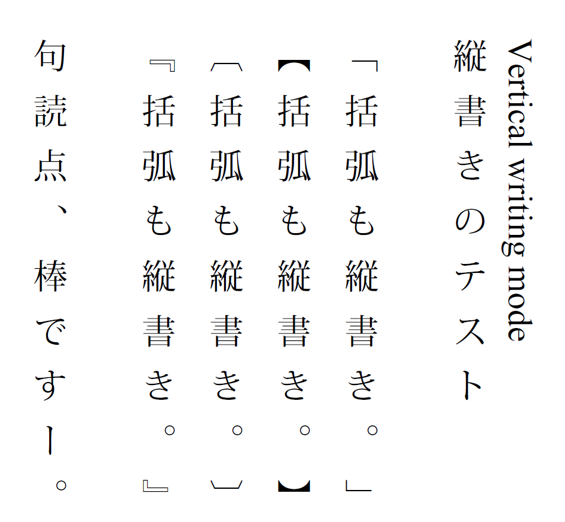
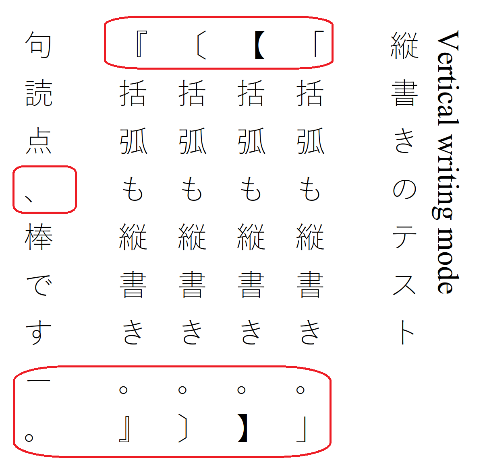

# Vertical text handling

As described throughout ISO 32000-2:2020, clause 9 "Text", handling of vertical text requires special attention to glyph origin and displacement vectors. If not handled correctly horizonal glyphs can be used in place of vertical glyphs, as illustrated by Figure 55:

## Correct appearance

## Incorrect appearance

# Test file

[VerticalText.pdf](VerticalText.pdf)
Renders Japanese vertical text using a non-embedded font with appropriate font and font descriptor entries for vertical writing.
